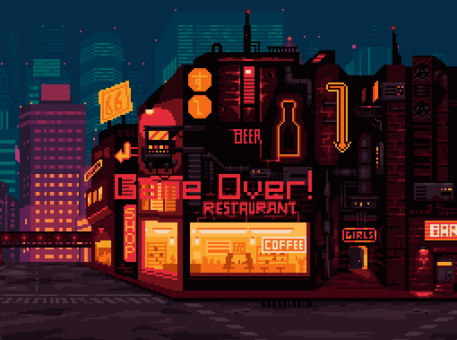

  

  <h1>Dapper Dasher</h1>

  
A simple game made using C++ and Raylib.

  
  

    <h3>Controls</h4>
    Space: Jump &nbsp;
    
  

  

    <b>How to Run</b> 
    1. Download and unzip the folder. 
    2. Launch <code>main.exe</code>.
  

  

    

      
<b>📸 View End Screens</b> (Click to Expand)

       
      
      
    

  

  

    <b>Notes</b> 
    Version: 0.1.0 &nbsp;•&nbsp; Found a bug? Open an issue.
  

